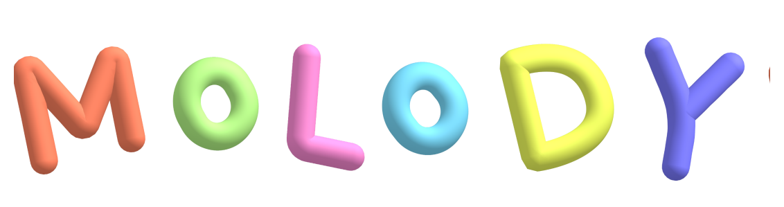

# MOLODY

 

  

  <strong>Molody는 매일 아침 당신을 위한 멜로디를 이메일로 보내드립니다.</strong>

 

## ✨ 주요 기능

- **🎵 아침의 멜로디**: 매일 아침 이메일로 새로운 음악을 추천받고 감상할 수 있습니다.
- **✍️ 음악 추천하기**: 다른 사람들과 함께 듣고 싶은 나만의 음악을 직접 추천할 수 있습니다.
- **👤 간편한 인증**: 이메일만으로 간편하게 로그인하고 구독 서비스를 이용할 수 있습니다.

## 🛠️ 기술 스택

- **Framework**: [Next.js](https://nextjs.org/) (with Turbopack)
- **Language**: [TypeScript](https://www.typescriptlang.org/)
- **Backend & DB**: [Supabase](https://supabase.io/)
- **Email**: [SendGrid](https://sendgrid.com/)
- **Styling**: [Tailwind CSS](https://tailwindcss.com/)
- **UI**: [shadcn/ui](https://ui.shadcn.com/)
- **Form**: [React Hook Form](https://react-hook-form.com/), [Zod](https://zod.dev/)
